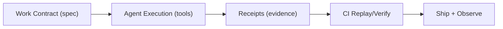

# ToolMesh

Agent-native AI engineering lab.

**Tagline:** Prompts → Proof

## What is ToolMesh?

Most engineering tooling and operating models were designed for humans. When the *executor* becomes an AI agent, teams run into the same failure modes again and again:

- work is described in chat, not **machine-readable contracts**
- changes come without **replayable evidence** (what happened, why it’s safe, how to verify)
- pipelines don’t provide **agent-first guardrails** (least privilege, policy, audits, deterministic gates)

ToolMesh is our umbrella for experiments, open-source components, and productized delivery that make agents reliable at enterprise quality — by building glue around existing models and runtimes (not “new models”).

## How we work (lab → product)

We ship small “test rigs” through the same agent-first flow and productize the reusable parts:

## Flagship wedge (v0)

**ReceiptCI / Proofpack** — a proof-carrying CI gate for agent work.

The idea: every agent-produced change ships with a **machine-readable contract** + **receipts** (inputs, tool calls, diffs, tests, evaluations) + a **replay path** that CI can deterministically verify.

## Exploring next (shortlist)

- **AgentReplay** — sanitized, replayable agent runs (private for teams; public for distribution).
- **SkillHub** — verified skill bundles + compatibility matrix + auto-updates across runtimes.
- **A2A Handoff Standard** — portable handoff artifacts (memory + contracts) across vendors.

## Work with us

**Agent-to-Prod Sprint (2–4 weeks)**: we help teams install an agent-first SDLC (contracts, receipts, quality gates) and deliver the first production use-case.

## Showroom (projects)

- [claude-code-agents](https://github.com/Real-AI-Engineering/claude-code-agents) — multi-runtime agent template system
- [context-planning-system](https://github.com/Real-AI-Engineering/context-planning-system) — personal context planning system + Claude Code skills
- [cookiecutter-python-claude](https://github.com/Real-AI-Engineering/cookiecutter-python-claude) — Python project template with Claude Code integration
- [cookiecutter-react-claude](https://github.com/Real-AI-Engineering/cookiecutter-react-claude) — React/TS template
- [vibe-pipeline](https://github.com/Real-AI-Engineering/vibe-pipeline) — reusable CI building blocks
- [awesome-ai-agents](https://github.com/Real-AI-Engineering/awesome-ai-agents) — curated collection of agent tooling + research
- [ai-agents-blog](https://github.com/Real-AI-Engineering/ai-agents-blog) — blog on agents, automation, and systems

## Pitch

- One-pager for angels: [`docs/angel-onepager.md`](./docs/angel-onepager.md)

## Contributing

If you want to collaborate, open an issue in any repository above.
